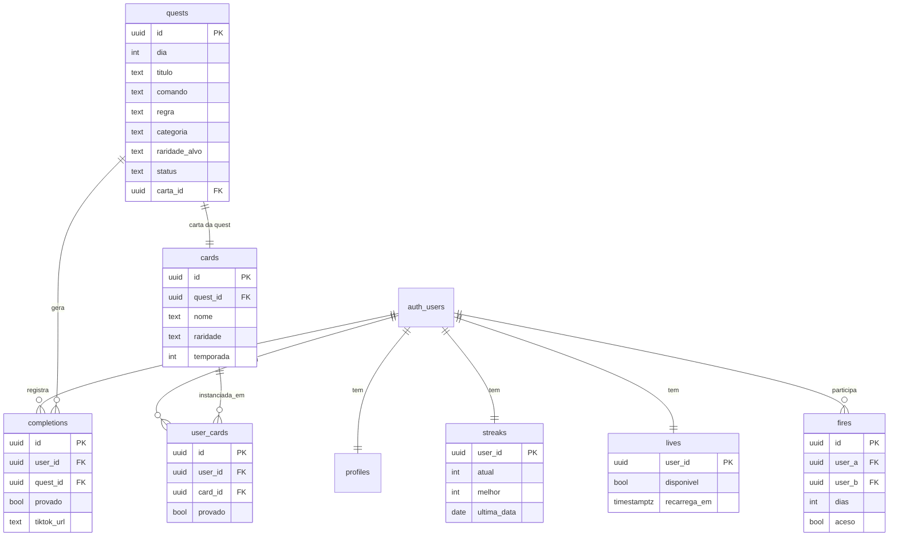

# Modelagem de Dados — Caos Diário

> Fonte de verdade técnica: `supabase/schema.sql`. Este doc descreve e explica.
> Isolamento **por usuário** (`auth.uid()`), NÃO por tenant (ADR-010).
> Última atualização: 2026-07-24.

## Diagrama ER

## Entidades

| Tabela | Papel | Cardinalidade | RLS |
|---|---|---|---|
| `profiles` | dados públicos do usuário (username, título) | 1:1 com `auth.users` | SELECT público; escrita só do dono |
| `quests` | banco de quests curadas | — | SELECT só se `status = 'publicada'`; escrita via Edge Function |
| `cards` | catálogo de cartas (arte por quest/temporada) | 1:1 com quest | SELECT público |
| `completions` | registro de CUMPRI | N por usuário, 1 por (usuário, quest) | só do dono |
| `streaks` | estado de sequência | 1:1 com usuário | só do dono |
| `lives` | vidas (1/24h) | 1:1 com usuário | só do dono |
| `user_cards` | álbum do usuário | N por usuário | só do dono |
| `fires` | Fogo do Caos (dupla) | N | só participantes |

## Decisões de modelagem

- **Idempotência do CUMPRI:** `completions UNIQUE (user_id, quest_id)` — clicar 2× não
  cria 2 completions nem 2 cartas. Área de risco vigiada (`memory/bugs.md`).
- **Só a URL do TikTok:** `completions.tiktok_url` guarda **apenas** o link público
  (ADR-006) — nunca o vídeo. Se null e `provado=false`, é honra pura.
- **Streak como estado, não derivação:** `streaks` materializa `atual/melhor/ultima_data`
  pra leitura barata; recalculado na virada do dia por Edge Function.
- **Escrita privilegiada isolada:** publicar quest, conceder carta, recarregar vida e
  fechar o dia rodam com `service_role` em Edge Function — nunca no cliente.
- **Sem `tenant_id`:** exceção consciente ao padrão multi-tenant (ADR-010). Toda política
  RLS é `auth.uid() = user_id`.

## Convenção de migrations

- Arquivo: `supabase/migrations/YYYYMMDD_descricao.sql` (ex: `20260724_criar_quests.sql`).
- **Toda tabela nasce com RLS habilitado na mesma migration** (definition-of-done).
- Migration aplicada é imutável; correção = nova migration.

## Ligações
- `supabase/schema.sql` — DDL de referência.
- `docs/03_REGRAS_DE_NEGOCIO` — as regras que estes dados sustentam.
- `docs/11_SEGURANCA` — políticas RLS e ameaças.
