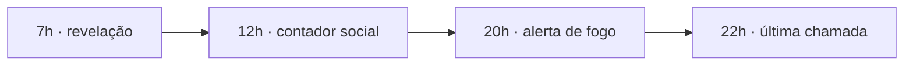
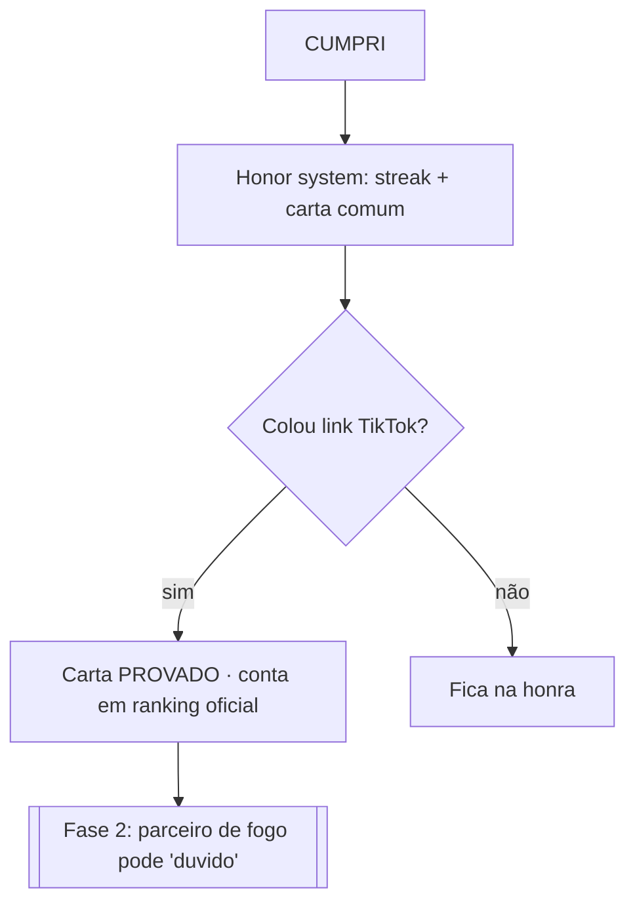

# Fluxos — Caos Diário

> Fonte: CAOS_FUNDACAO.md §2. Como o usuário atravessa o produto.
> Última atualização: 2026-07-24.

## Fluxo principal — o loop diário

```mermaid
flowchart TD
    P[7h · push "A QUEST DE HOJE CAIU"] --> A[Abre app]
    A --> C{Já são 7h?}
    C -- não --> CD[Countdown: "o caos chega em 02:14:33"]
    C -- sim --> Q[Card revela a quest do dia]
    Q --> R[Cumpre no mundo real + filma]
    R --> T[Posta no TikTok com #CaosDia N]
    T --> V[Volta ao app]
    V --> M{Marca CUMPRI?}
    M -- CUMPRI --> L{Colar link do TikTok?}
    L -- sim --> PR[Carta com selo PROVADO]
    L -- não --> HO[Carta comum · honra]
    PR --> S[Streak +1 · carta no álbum]
    HO --> S
    M -- PULEI/falhou --> VD{Tem vida?}
    VD -- sim --> AB[Vida absorve · streak sobrevive · SEM carta]
    VD -- não --> Z[Streak ZERA]
    S --> FEED[Feed do TikTok enche → novos downloads]
```

## Fluxo dos 4 toques diários


- **7h:** "A QUEST DE HOJE CAIU."
- **12h:** "8.412 já cumpriram. Você não."
- **20h:** "Guilherme ainda não cumpriu." (cobrança de fogo)
- **22h:** "2h pro caos fechar."

## Fluxo de verificação (ADR-006)



## Fluxo de onboarding (intuitividade — mínimo atrito)

1. Abre o app → **vê a quest de hoje na hora** (sem tutorial obrigatório).
2. Login só quando for marcar CUMPRI (pra salvar streak/carta).
3. Push é oferecido no 1º CUMPRI (opt-in claro — LGPD).

## Estados de borda a tratar
- Antes das 7h: countdown, não mostra a quest.
- Virada de meia-noite (fuso Brasil): fecha o dia, recalcula streak/vida.
- Sem internet: shell offline do PWA; CUMPRI enfileira e sincroniza.
- CUMPRI duplicado: idempotente (`completions` unique).

## Ligações
- `docs/03_REGRAS_DE_NEGOCIO` — regras por trás de cada passo.
- `docs/06_COMPONENTES` — as telas que materializam os fluxos.
